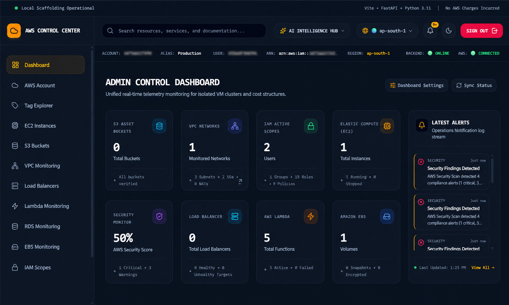

<div align="center">

  
</div>

---

## 🧭 About Me

I'm **Sridhar**, an AWS-focused Cloud Engineer interested in designing and building reliable, secure, scalable, and cost-aware cloud systems.

My engineering focus is on understanding systems from the architecture level to implementation — including cloud infrastructure, backend services, containerization, infrastructure as code, observability, security, and deployment automation.
I enjoy building practical cloud projects that combine **AWS architecture, automation, monitoring, security, and cost optimization** into production-oriented solutions.
---

## ☁️ Engineering Focus

| Area | Focus |
|---|---|
| ☁️ Cloud Architecture | AWS infrastructure and cloud-native system design |
| 🏗️ Infrastructure | AWS resources, networking and infrastructure automation |
| ⚙️ DevOps | CI/CD, Docker and deployment automation |
| 🔐 Security | IAM, least privilege and secure cloud practices |
| 📊 Observability | Monitoring, health checks and operational visibility |
| 💰 Cost Optimization | Cloud cost awareness and resource efficiency |
| 🧱 Architecture | Clean Architecture and maintainable system design |

---

## 🚀 Flagship Project

# ☁️ Cloud Control Center

> **AWS Infrastructure Control, Monitoring & Cloud Operations Platform**

A centralized cloud management platform designed to help cloud engineers monitor, analyze, and interact with AWS infrastructure through a unified interface.

### ⚡ Core Capabilities

| Capability | Purpose |
|---|---|
| 🖥️ **EC2 Control** | Monitor and manage AWS compute resources |
| 💰 **Cost Guard** | AWS Cost Explorer-based cost visibility |
| 🔐 **IAM Security** | IAM integration with least-privilege principles |
| 📊 **Service Telemetry** | AWS service health and connectivity monitoring |

### 🏗️ Architecture

```text
React + Vite + TypeScript
          ↓
      FastAPI
          ↓
  Clean Architecture
          ↓
   Boto3 / AWS SDK
          ↓
 ┌────────┬────────┬──────────────┐
 │  EC2   │  IAM   │ Cost Explorer│
 └────────┴────────┴──────────────┘
          ↓
       AWS Cloud
```
## 🏗️ System Architecture

```text
                    ┌─────────────────────┐
                    │   React Dashboard   │
                    │   Vite + Tailwind   │
                    └──────────┬──────────┘
                               │
                            HTTPS/REST
                               │
                    ┌──────────▼──────────┐
                    │      FastAPI        │
                    │      Backend        │
                    └──────────┬──────────┘
                               │
                    ┌──────────▼──────────┐
                    │  Clean Architecture │
                    │                     │
                    │ Handlers / Routes   │
                    │ Use Cases           │
                    │ Domain / Models     │
                    │ Repositories        │
                    └──────────┬──────────┘
                               │
              ┌────────────────┼────────────────┐
              │                │                │
       ┌──────▼─────┐   ┌──────▼─────┐   ┌────▼─────┐
       │   Boto3    │   │ PostgreSQL │   │ SQLAlchemy│
       │ AWS SDK    │   │ Database   │   │    ORM    │
       └──────┬─────┘   └────────────┘   └───────────┘
              │
       ┌──────▼──────────────────────────┐
       │          AWS Services            │
       │ EC2 • IAM • Cost Explorer • etc │
       └─────────────────────────────────┘
### 📸 Dashboard Preview


